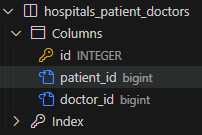

# N:M 관계
한 테이블의 0개 이상의 레코드가 다른 테이블의 0개 이상의 레코드와 관련된 경우
> 양쪽 모두에서 N:1 관계를 가진다.

  #### 기존 N:1 모델의 문제
  A모델과 B모델이 1:N, N:1을 모두 만족해야만 할 때, 이를 DB에 저장하는 것은 불가능하다.

## 중개 모델
위의 상황에서 A모델과 B모델 모두에 1:N 관계를 가지는 중간다리 모델을 만든다.
> 이를 중개 모델이라 부른다.

## ManyToManyField
`ManyToManyField(to, **options)`<br>
Django에서 자동으로 중개 모델을 생성해주는 모델 필드
- 두 모델의 구조에 변화를 주는 것은 아니다.

### 특징
- 양방향 관계
  - 어느 모델에서든 관련 객체에 접근할 수 있음
- 중복 방지
  - 동일한 관계는 한 번만 저장됨

### N:M 모델 생성
1. B 모델에 ManyToManyField 작성
   > A 모델에 작성해도 상관 없지만 **참조/역참조 관계**를 잘 기억해야 한다.
    ```python
    # models.py

    class ModelA(models.Model):
      ...

    class ModelB(models.Model):
      # 중개 모델의 인스턴스는 일반적으로 복수형으로 지정
      modelas = models.ManyToManyField(ModelA)
      ...
    ```
2. DB 초기화 후 Migration 진행
3. 생성된 중개 테이블 확인
    

### 한계점 
- 각 모델에 있는 속성 외에 추가 정보를 포함시킬 수 없다.

## through argument
중개 테이블에 '**추가 데이터**'를 사용해 N:M 관계를 형성하려는 경우에 사용

### 예시
- 중개 모델 클래스 작성 및 through 설정
   ```python
   class ModelA(models.Model):
    ...

   class ModelB(models.Model):
    # through 설정
    modelas = models.ManyToManyField(ModelA, through='Reservation')
    ...

   # 중개 모델 클래스 작성
   class Mediation(models.Model):
    modela = models.ForeignKey(ModelA, on_delete=models.CASCADE)
    modelb = models.ForeignKey(ModelB, on_delete=models.CASCADE)
    var_a = models.TextField()
    var_b = models.DateTimeField(auto_now_add=True)
    ...
   ```

### 데이터 생성 방법
1. Mediation class를 통한 데이터 생성
   ```python
   mediation1 = Mediation(modela='a', modelb='b', var_a='medi')
   mediation1.save()
   ```
2. through_defaults를 통한 데이터 생성
   ```python
   modelb1.modelas.add('a', through_defaults={'var_a': 'medi'})
   ```

### N:M 관계 주의사항
- N:M 관계로 맺어진 두 테이블에는 물리적인 변화는 없다.
- ManyToManyField는 중개 테이블을 자동으로 생성한다.
- ManyToManyField는 N:M 관계를 맺는 두 모델 어디에 위치해도 상관 없다.
  > 다만 필드 작성 위치에 따라 참조와 역참조 방향이 결정된다.
- 1:N은 완전 종속의 관계였지만 N:M은 종속적인 관계가 아니다.

### 추가적인 ManyToManyField 추가 인자
1. `related_name` : 역참조를 할 때 사용하는 manager name을 변경할 때 사용
   ```python
   class ModelB(models.Model):
    modelas = models.ManyToManyField(ModelA, related_name='modelbs')

   # 변경 전
   modela.modelb_set.all()

   # 변경 후
   modela.modelbs.all()
   ```

2. `symmetrical` : 
   - 관계 설정 시 대칭 유무 설정
   - ManyToManyField가 동일한 모델을 가리키는 정의에서만 사용 가능
   - 기본값 : True
   ```python
   # 예시

   class Person(models.Model):
    friends = models.ManyToManyField('self')
    # friends = models.ManyToManyField('self', symmetrical=False)
   ```

    #### True일 경우
    - source 모델의 인스턴스가 target 모델의 인스턴스를 참조하면 자동으로 target 모델 인스턴스도 source 모델 인스턴스를 자동으로 참조하도록 함
      > source 모델
      > - 관계를 시작하는 모델
      > target 모델
      > - 관계의 대상이 되는 모델
    - A가 B의 친구라면, 자동으로 B도 A의 친구가 된다.

    #### False일 경우
    - True일 때와 반대된다.
3. `through` :
   - 사용하고자 하는 중개 모델 지정
   - 일반적으로 추가 데이터를 N:M 관계와 연결하려는 경우에 활용
   #### 대표 조작 methods
   - `add()`
     - 관계 추가
     - 지정된 객체를 관련 객체 집합에 추가
   - `remove()`
     - 관계 제거
     - 관련 객체 집합에서 지정된 모델 객체를 제거

## 좋아요 기능 구현
1. 모델 관계 설정
   ```python
   # models.py

   class Article(models.Model):
    user = models.ForeignKey(settings.AUTH_USER_MODEL, on_delete=models.CASCADE)
    like_users = models.ManyToManyField(settings.AUTH_USER_MODEL, related_name='like_articles')
   ```
   #### like_users에 related_name을 설정하는 이유
   - 이미 이전 user와의 N:1 관계에서 같은 이름의 매니저를 사용 중이므로, ManyToManyField에 related_name을 작성한다.
     > ForeignKey에 작성해도 무관하다.

2. url 작성
   ```python
   # urls.py

   ...
   urlpatterns = [
    ...,
    path('<int:article_pk>/likes/', views.likes, name='likes'),
   ]
   ```

3. view 함수 작성
   ```python
   # views.py
   
   @login_required
   def likes(request, article_pk):
    article = Article.objects.get(pk=article_pk)
    if request.user in article.like_users.all():
      article.like_users.remove(request.user)
    else:
      article.like_users.add(request.user)
    return redirect('articles:index')
   ```

4. index 템플릿에 좋아요 버튼 출력
   ```html
   <!-- index.html -->

   
    ...
    <form action="" method="POST">
      
      
        <input type="submit" value="좋아요 취소">
      
        <input type="submit" value="좋아요">
      
    </form>
    ...
   
   ```

## 팔로우 기능 구현
### 프로필 페이지
- 팔로우 기능을 구현할 프로필 페이지를 먼저 구현

#### 과정
1. url 작성
   ```python
   # urls.py

   urlpatterns = [
    ...,
    path('profile/<str:username>/', views.profile, name='profile'),
   ]
   ```
   > 바로 <str:username>으로 시작할 경우, 들어오는 문자열을 모두 받아들이기 때문에 이 후의 path에는 도달할 수 없다.
   >
   > 따라서, 맨 밑에 위치시키거나, 'profile'과 같은 앞쪽에 추가 작업이 필요하다.

2. view 함수 작성
   ```python
   # views.py

   from django.contrib.auth import get_user_model

   def profile(request, username):
    User = get_user_model()
    person = User.objects.get(username=username)
    context = {
      'person': person,
    }
    return render(request, 'accounts/profile.html', context)

3. profile 템플릿 작성 및 프로필 페이지 이동 링크 작성
   ```html
   <!-- index.html -->

   <a href="">내 프로필</a>

   <!-- 또는 -->
   <p>작성자 : <a href="">{{ article.user }}</a></p>
   <!-- `article.user.username` 대신 `user.username`을 쓰면, 원하는 대상이 아닌 로그인한 사용자의 프로필로 이동함에 주의한다. -->

### 팔로우
1. User N:M 관계 생성
   ```python
   # models.py

   class User(AbstractUser):
    followings = models.ManyToManyField('self', symmetrical=False, related_name='followers')

   # User 간의 기능이므로, self 사용
   # 참조 : followings
   # 역참조 : followers
   # symmetrical=False의 역할은 내가 대상을 팔로우했다고 해서, 상대도 나에게 자동 팔로우 되는 것을 방지

2. Migration 진행 후 중개 테이블 확인

3. url 작성
   ```python
   # urls.py

   urlpatterns = [
    ...,
    path('<int:user_pk>/follow/', views.follow, name='follow'),
   ]
   ```

4. view 함수 작성
   ```python
   # views.py

   @login_required
   def follow(request, user_pk):
    User = get_user_model()
    person = User.objects.get(pk=user_pk)
    if person != request.user:
      if request.user in person.followers.all():
        person.followers.remove(request.user)
      else:
        person.followers.add(request.user)
    return redirect('accounts:profile', person.username)
   ```

5. 프로필 유저의 팔로잉, 팔로워 수, 그리고 팔로우/언팔로우 버튼 작성
   ```html
   <!-- profile.html -->

   <!-- 팔로잉 -->
   {{ person.followings.all|length }}

   <!-- 팔로워 수 -->
   {{ person.followers.all|length }}

   <!-- 팔로우/언팔로우 버튼 -->
   <form action="" method="POST">
    
    
      <input type="submit" value="Unfollow">
    
      <input type="submit" value="follow">
    
   </form>
   ```

## Fixtures
Django가 DB로 가져오는 방법을 알고 있는 데이터 모음
- 데이터는 DB 구조에 맞추어 작성되어있다.

### 목적
- 초기 데이터를 제공하기 위함이다.

  # 초기 데이터 필요성
  - `.gitignore`로 인해 DB는 업로드 되지 않는다.
  - 따라서 다른 사람들은 DB가 업는 프로젝트를 받게 된다.
  - 위 상황을 보완하고자 프로젝트 앱을 처음 설정할 때 동일하게 준비 된 데이터로 DB를 미리 채운다.

### fixtures 관련 명령어
- `dumpdata` : DB의 모든 데이터를 추출
  - 작성 예시
    ```
    $ python managy.py dumpdata [app_name[.ModelName]] [app_name[.ModelName] ...] > filename.json
    ```

> Fixtures 파일을 **직접 만들지 말고** 반드시 `dumpdata` 명령어를 사용하여 생성

- `loaddata` : Fixtures 데이터를 DB로 불러오기
  - Fixtures 파일 기본 경로
    `app_name/fixtures/`
    > Django는 설치된 모든 app의 디렉토리에서 fixtures 폴더 이후 경로로 fixtures 파일을 찾아 load
  - 작성 예시
    ```
    $ python manage.py loaddata articles.json users.json comments.json
  - 주의 사항
    - 한 번에 모든 데이터를 받아오도록 loaddata를 실행할 때는 문제되는 것이 없다.
    - 각 앱에 대해 별도로 실행한다면, 모델 관계에 따른 순서가 중요하므로 load 순서를 중요시 해야한다.
      - 모델 C는 모델 A와 B에 대한 key가 필요
      - 모델 B는 모델 A에 대한 key가 필요
      - 따라서 A - B - C 의 순으로 data를 load해야함

## Improve query
같은 결과를 얻기 위해 DB 측에 보내는 query 개수를 점차 줄여 조회하는 방법

### annotate
- SQL의 GROUP BY를 사용
- 쿼리셋의 각 객체에 계산된 필드를 추가
- 집계 함수와 함께 자주 사용
  
  #### 예시
  `Article.objects.annotate([name]=Count('comment'))`
  - 각 게시글마다 댓글 수를 계산
  - 게시글로 GROUP BY 진행
  - 별개의 [name] 필드를 만들어 값을 저장

### select_related
- SQL의 INNER JOIN 사용
- 1:1 또는 N:1 참조 관계에서 사용
- 단일 쿼리로 관련 객체를 함께 가져와 성능 향상

  #### 예시
  `Article.objects.select_related('writer')`
  - Article 모델과 연관된 작성자 모델 데이터를 함께 가져옴
  - N에 해당하는 모델이 1에 해당하는 모델 데이터를 조회

### prefetch_related
- SQL이 아닌 Python을 사용한 JOIN 진행
  - 관련 객체들을 미리 가져와 메모리에 저장
- N:M 또는 1:N 역참조 관계에서 사용

  #### 예시
  `Article.objects.prefetch_related('user')`
  - Article 모델과 연관된 모든 User 모델 데이터를 미리 가져옴
  - Django가 별도의 쿼리로 User 데이터를 가져와 관계를 설정