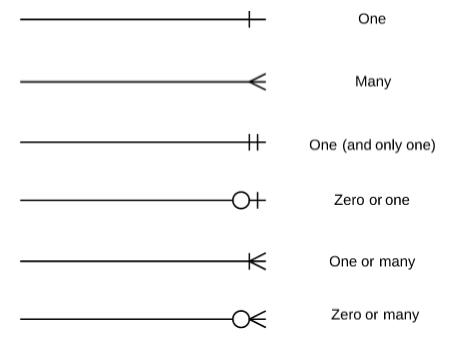

# Multi Table Query
- 관계
  - 여러 테이블 간의 논리적 연결

## JOIN
둘 이상의 테이블에서 데이터를 검색하는 방법

### INNER JOIN
두 테이블에서 값이 일치하는 레코드에 대해서만 결과를 반환
```sql
SELECT select_list
FROM table_a INNER JOIN table_b
    ON table_b.fk = table_a.pk;
```
- FROM 절 이후 메인 테이블 지정
- INNER JOIN 절 이후 메인 테이블과 조인할 테이블을 지정
- ON 키워드 이후 조인 조건을 작성
- 조건은 조인되는 두 테이블의 레코드를 일치시키는 규칙으로 지정

### LEFT JOIN
오른쪽 테이블의 일치하는 레코드와 함께 왼쪽 테이블의 모든 레코드 반환
```sql
SELECT select_list
FROM table_a LEFT JOIN table_b
    ON table_b.fk = table_a.pk;
```
- INNER JOIN과 다르게 LEFT JOIN에서 ON을 이용해 조건을 작성하면, 양쪽 테이블이 아닌 **왼쪽 테이블**의 각 레코드를 오른쪽 테이블의 모든 레코드와 일치시킴
> 따라서, 결과에 왼쪽 테이블의 모든 레코드가 표시된다.
>
> 오른쪽 테이블과 매칭되지 않는 레코드는 해당 필드에 NULL을 표시한다.

<br></br>
# 1 : N 관계 모델
한 테이블에서 0개 이상의 레코드가 다른 테이블의 레코드 한 개와 관련된 관계

## 댓글 모델 정의
- `ForeignKey()` : 한 모델이 다른 모델을 참조하는 관계를 설정하는 필드
  - 1 : N 관계 표현

> 외래키 클래스의 인스턴스 이름은 참조하는 모델 클래스 이름의 **단수형**으로 작성하는 것을 권장한다.
>
> 외래키는 클래스를 작성하는 위치와 상관없이 테이블의 마지막 필드로 생성된다.

- `ForeignKey(to, on_delete)`
  - to : 참조하는 모델 class 이름
  - on_delete : 외래키가 참조하는 객체(1)가 사라졌을 때, 외래키를 가진 객체(N)를 어떻게 처리할 지를 정의하는 설정
    > **데이터 무결성**에 관한 내용이다.

<br>

> 만약 `on_delete = models.CASCADE`로 지정하면,
>
> 참조 된 객체가 삭제될 때 이를 참조하는 모든 객체도 삭제된다.

## 역참조
1:N 관계에서 1에서 N을 참조하거나 조회하는 것을 의미한다.
- 모델 간의 관계에서 관계를 정의한 모델이 아닌, 관계의 대상이 되는 모델에서 연결된 객체들에 접근하는 방식
  > N은 외래키가 있어 물리적인 참조가 가능하지만, 1은 N에 대한 참조 방법이 존재하지 않아 별도의 역참조 키워드가 필요하다.

### 참조와 역참조
- 참조
  - 1번 댓글이 작성된 게시글 참조
- 역참조
  - 1번 게시글에 작성된 모든 댓글 참조

### 역참조 이름
- `article.comment_set.all()`
  - 특정 게시글에 작성된 댓글 전체를 조회하는 요청

### related manager 
- 일대다 또는 다대다 관계에서 역참조 시에 사용하는 매니저

  #### 이름 규칙
  - 일대다 관계에서 생성되는 Related Manager 이름은 **"모델명_set"** 형태로 자동 생성된다.
    > 관계를 직접 정의하지 않은 모델에서 연결된 객체들을 조회할 수 있게 된다.

## 댓글 구현
### CREATE
1. CommentForm 정의
```python
# forms.py

from .models import Article, Comments

class CommentForm(forms.ModelForm):
  class Meta:
    model = Comments
    fields = '__all__'
```

2. detail view 함수에서 CommentForm을 사용하여 detail 페이지에 렌더링
```python
# views.py

from .forms import CommentForm

def detail(request, pk):
  article = Article.objects.get(pk=pk)
  comment_form = CommentForm()
  context = {
    'article': article,
    'comment_form': comment_form,
  }
  return render(request, 'articles/detail.html', context)
```

3. 외래키 필드를 사용자로부터 전달받는 것이 아닌 **view 함수 내에서 다른 방법으로 전달 받아 저장**되도록 변경
```python
# forms.py

from .models import Article, Comments

class CommentForm(forms.ModelForm):
  class Meta:
    model = Comments
    fields = ('content',)
```

4. 출력에서 제외된 외래키 데이터를 받음
```python
# urls.py

urlpatterns = [
  ...,
  path('<int:pk>/comments/', views.comments_create, name='comments_create'),
]
```
```html
<!-- detail.html -->

<form action="" method="POST">
  
  {{ comment_form }}
  <input type="submit">
</form>
```

5. comments_create view 함수 정의
- 미완성
```python
views.py

def comments_create(request, pk):
  # 댓글은 조회를 요청하는 GET 요청이 들어올 일이 없으므로(이미 detail에서 표시 중이므로) POST를 구분하는 조건문을 사용하지 않는다.
  article = Article.objects.get(pk=pk)
  comment_form = CommentForm(request.POST)
  # Form을 통해 입력받고 있어 article(외래키)가 전달받지 못하고 있다.
  if comment_form.is_valid():
    # 외래키 데이터를 넣는 타이밍이 필요
    # 외래 키를 넣으려면 2가지 조건 필요
    # 1. comment 인스턴스 필요
    # 2. save 메서드가 호출 되기 전이어야 함
    # 그런데 comment 인스턴스는 save 메서드가 호출되어야 생성된다...
    # `save(commit=False)` 활용
    comment_form.save()
    return redirect('articles:detail', article.pk)
  context = {
    'article': article,
    'comment_form': comment_form,
  }
  return render(request, 'articles/detail.html', context)
```
- `save(commit=False)` : DB에 저장 요청을 보내지 않고 인스턴스만 반환

<br>

- 최종
```python
views.py

def comments_create(request, pk):
  article = Article.objects.get(pk=pk)
  comment_form = CommentForm(request.POST)

  if comment_form.is_valid():
    ###########################
    comment = comment_form.save(commit=False)
    comment.article = article
    comment.save()
    ###########################
    return redirect('articles:detail', article.pk)
  context = {
    'article': article,
    'comment_form': comment_form,
  }
  return render(request, 'articles/detail.html', context)
```

### READ
1. detail view 함수에서 전체 댓글 데이터를 조회
```python
# views.py

from .models import Comments

def detail(request, pk):
  article = Article.objects.get(pk=pk)
  comment_form = CommentForm()
  comments = article.comments_set.all()
  context = {
    'article': article,
    'comment_form': comment_form,
    'comments': comments,
  }
  return render(request, 'articles/detail.html', context)
```

2. detail 페이지에 댓글 출력
```html
<!-- detail.html -->

<ul>
  
    <li>{{ comment.content }}</li>
  
</ul>
```

### DELETE
1. 댓글 삭제 url 작성
```python
# urls.py

urlpatterns = [
  ...,
  path('<int:article_pk>/comments/<int:comment_pk>/delete', views.comments_delete, name='comments_delete'),
]
```

2. 댓글 삭제 view 함수 정의
```python
# views.py

from .models import Comments

def comments_delete(request, article_pk, comment_pk):
  comment = Comments.objects.get(pk=comment_pk)
  comment.delete()
  return redirect('articles:detail', article_pk)

# 만약 단일 pk를 쓸경우
def comments_delete(request, pk):
  comment = Comment.objects.get(pk=pk)
  # comment 삭제 전 참조하던 게시글의 pk를 따로 저장해둔다.
  article_pk = comment.article.pk
  comment.delete()
  return redirect('articles:detail', article_pk)
```

## 유저와 게시글
1. User 외래키 정의
```python
# models.py
from django.conf import settings


class Article(models.Model):
  user = models.ForeignKey(settings.AUTH_USER_MODEL, on_delete=models.CASCADE)
  ...
```

  #### USER 모델을 참조하는 2가지 방법
  - Django는 유저 객체가 존재하기 전에 유저 참조가 먼저 일어난다.
  - `models.py`가 먼저 구동되므로 get_user_model()의 반환 과정에서 문제가 발생한다.

  ||`get_user_model()`|`settings.AUTH_USER_MODEL`|
  |:----:|:----------------:|:-------:|
  |반환 값|User Object<br>(객체)|accounts.User<br>(문자열)|
  |사용 위치|models.py가 아닌 모든 위치|models.py|

  > User모델은 직접 참조하지 않는다.

2. Migration
- 새로운 필드가 추가되었으니 migrate를 진행한다.
- `NOT NULL`로 인해 Django로부터 기본값 입력을 권유받을 경우
- 1번은 Django가 이전 게시물의 외래키를 모두 1로 통일시킨다.
- 2번은 제작자가 모델에 기본값을 입력해야한다.

## 게시글 CREATE
1. ArticleForm 필드 수정
```python
# forms.py

class ArticleForm(forms.ModelForm):
  class Meta:
    model = Article
    # user_id를 빼고 출력한다.
    fields = ('title', 'content',)
```

2. 게시글 작성 시 작성자 정보가 함께 저장될 수 있도록 변경
```python
# views.py

@login_required
def create(request):
  if request.method == "POST":
    ...
    if form.is_valid():
      article = form.save(commit=False)
      article.user = request.user
      article.save()
      return redirect('articles:detail', article.pk)
  else:
    ...
```

## 게시글 READ
- 해당하는 html 페이지에 user 정보를 띄우면 된다.
```html
<p>{{ [key_name].user }}</p>`
```

## 게시글 UPDATE
1. 게시글 수정 요청 사용자와 작성 사용자를 비교하여 본인의 게시글만 수정할 수 있도록 함
```python
# views.py

@login_required
def update(request, pk):
  article = Article.objects.get(pk=pk)
  if request.user == article.user:
    if request.method == "POST":
      form = ArticleForm(request.POST, instance=article)
      if form.is_valid():
        form.save()
        return redirect('articles:detail', article.pk)
    else:
      form = ArticleForm(instance=article)
  else:
    return redirect('articles:index')
```

2. 게시글 작성자가 아니라면, 수정/삭제 버튼을 출력하지 않도록 하기
```html

  ...

```

## 게시글 DELETE
1. 본인의 게시글만 삭제 할 수 있도록 변경
```python
# views.py

@login_required
def delete(request, pk):
  article = Article.objects.get(pk=pk)
  if request.user == article.user:
    article.delete()
  return redirect('articles:index')
```

## 유저와 댓글
Comment model에 user 외래키 정의
```python
# models.py

class Comments(models.Model):
  ...
  user = models.ForeignKey(settings.AUTH_USER_MODEL, on_delete=models.CASCADE)
  ...
# 이후 migrate 진행
```

## 댓글 CREATE
```python
def comments_create(request, pk):
article = Article.objects.get(pk=pk)
comment_form = CommentForm(request.POST)
if comment_form.is_valid():
  # 게시글도 마찬가지로 참조 진행
  comment = comment_form.save(commit=False)
  comment.user = request.user
  comment.save()
  return redirect('articles:detail', article.pk)
...
```

## 댓글 READ
- `detail.html`의 댓글창에 댓글 작성자 추가
```html
<li>{{ comment.user }} - {{ comment.content }}</li>
```

## 댓글 DELETE
- 본인의 댓글을 삭제할 수 있도록 변경
```python
# views.py

@login_required
def comment_delete(request, article_pk, comment_pk):
  ...
  if request.user == comment.user:
    comment.delete()
  ...
```
- 추가로 본인 댓글이 아니면 댓글 삭제 버튼을 출력하지 않도록 하는 기능 삽입

## view decorators
View 함수의 동작을 수정하거나 추가 기능을 제공하는 데 사용되는 Python 데코레이터
> 코드의 재사용성을 높이고 뷰 로직을 간결하게 유지

### Allowed HTTP methods
- 특정 HTTP method로만 View 함수에 접근할 수 있도록 제한하는 데코레이터

  #### 주요 Allowed HTTP methods
  1. `required_http_methods(['METHOD1', 'METHOD2', ...])`
   - 지정된 HTTP method만 허용
  2. `require_safe()`
  - GET과 HEAD method만 허용
  3. `require_POST()`
   - POST method만 허용
  
  #### Allowed HTTP methods 주요 특징
  - 지정되지 않은 HTTP method로 요청이 들어오면 **HttpResponseNotAllowed (405)**를 반환
  - 대문자로 HTTP method를 지정

  #### require_GET 대신 require_safe를 권장하는 주요 이유
  - 웹 표준 준수
    - GET과 더불어 HEAD도 안전한 메소드로 간주됨
  - 호환성
    - 일부 소프트웨어는 HEAD 요청에 의존
  > 웹 표준을 준수하고,<br>
  > 더 넓은 범위의 클라이언트와 호환되며,<br>
  > 안전한 HTTP 메소드만을 허용하는 view 함수를 구현할 수 있다.

  #### decorator를 여러개 사용할 경우
  - 작성한 순서대로 작동하게 된다.

## ERD (Entity-Relationship Diagram)
- DB의 구조를 시각적으로 표현하는 도구
- 개체, 속성, 그리고 엔티티 간의 관계를 그래픅 형태로 나타내어 시스템의 논리적 구조를 모델링하는 다이어그램

### ERD 구성요소
1. 엔티티
   - DB에 저장되는 객체나 개념
   - ex) 고객, 주문, 제품
2. 속성
   - 엔티티의 특성이나 성질
   - ex) 고객(이름, 주소, 주민번호)
3. 관계
   - 엔티티 간의 연관성
   - ex) 고객이 '주문'한 제품

### Cardinality
- 한 엔티티와 다른 엔티티 간의 수적 관계를 나타내는 표현


### ERD의 중요성
- DB 설계의 핵심 도구
- 시각적 모델링으로 효과적인 의사소통 지원
- 실제 시스템 개발 전 데이터 구조 최적화에 중요

## 참고
### 데이터 무결성
- DB에 저장된 데이터의 정확성, 일관성, 유효성을 유지하는 것
- DB에 저장된 데이터 값의 정확성을 보장하는 것
> 중요성
> 1. 데이터의 신뢰성 확보
> 2. 시스템 안정성
> 3. 보안 강화