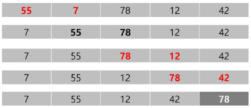

# List #1
## 알고리즘
유한한 단계를 통해 **문제를 해결하기 위한 절차나 방법**
<br>문제를 해결하기 위한 절차

### 좋은 알고리즘
1. `정확성` : 얼마나 정확하게 동작하는가
1. `작업량` : 얼마나 적은 연산으로 원하는 결과를 얻어내는가
1. `메모리 사용량` : 얼마나 적은 메모리를 사용하는가
1. `단순성` : 얼마나 단순한가
1. `최적성` : 더 이상 개선할 여지없이 최적화되었는가

### 시간복잡도 개요
알고리즘의 작업량을 표현할 때 시간복잡도로 표현한다.
- 실제 걸리는 시간을 측정
- 실행되는 명령문의 개수를 계산
  #### 빅-오(O) 표기법
  시간복잡도 함수 중에서 가장 큰 영향력을 주는 n에 대한 항만을 표시
  - 계수 생략

## 배열
일정한 자료형의 변수들을 하나의 이름으로 열거하여 사용하는 자료구조
### 배열의 필요성
- 프로그램 내에서 여러 개의 변수가 필요할 때, 하나의 선언을 통해 둘 이상의 변수를 선언할 수 있다.
- 다수의 변수로는 하기 힘든 작업을 배열을 활용해 해결할 수 있다.

### 배열 선언
- 크기가 정해져 있는 배열을 사용하는 것이 좋다.
- `append`는 시간이 상당히 걸리는 작업<br>=> 자료가 많을 때는 사용하지 않는 것이 좋음

## 정렬
2개 이상의 자료를 특정 기준에 의해 오름차순, 또는 내림차순으로 재배열하는 것

### 정렬 방식 종류
- 버블 정렬
- 카운팅 정렬
- 선택 정렬
- 퀵 정렬
- 삽입 정렬
- 병합 정렬

### 버블 정렬
인접한 두 개의 원소를 비교하며 자리를 계속 교환하는 방식

  #### 정렬과정
  1. 첫번째 원소부터 인접한 원소끼리 계속 자리를 교환하면서 맨 마지막 자리까지 이동
  2. 한 단계가 끝나면 가장 큰 원소가 마지막 자리로 정렬
    > 교환하며 자리를 이동하는 모습이 물 위에 올라오는 거품 모양과 같다고 하여 버블 정렬이라고 한다.

  #### 시간복잡도
  `O(n^2)`

  #### 예시
  
  > 앞에서부터 두 개씩 비교한다.<br>
  > 앞 순서의 값이 더 큰 경우 뒤와 자리를 바꾼다.<br>
  > 앞이 더 작다면, 자리를 바꾸지 않는다.<br>
  > 비교했던 값 중 가장 큰값이 맨 뒤로 간다면 한 패스가 종료된다.<br>
  > 패스를 반복하여 오름차순(혹은 내림차순) 형태가 되면 종료된다.

  ```python
  def BubbleSort(a, N):
    for i in range(N - 1, 0, -1):
      for j in range(0, i):
        if a[j] > a[j + 1]:
          a[j], a[j + 1] = a[j + 1], a[j]
  ```

### 카운팅 정렬
집합에 각 항목이 몇 개씩 있는지 세는 작업을 하여, 선형 시간에 정렬하는 알고리즘
> 버블 정렬은 시간복잡도가 `O(n^2)`으로 선형이 아니었다!

  #### 제약사항
  - 정수나 정수로 표현할 수 있는 자료에 대해서만 적용 가능
  - 카운트를 위한 공간을 위해 집합 내의 가장 큰 정수를 확인해야 함
    > 보통은 정수 범위가 100만 이내일 때 사용

  #### 카운팅 정렬 시간복잡도
  O(n + k) <span style = "color: #808080">=> 선형 시간</span>

  #### 예시
  ```python
  data = [0, 4, 1, 3, 1, 2, 4, 1]
  counts = [0] * 5

  n = len(data)
  temp = [0] * n

  # step 1. data 원소 별 개수 세기
  for d in data:
    counts[d] += 1

  # step 2. 원소 별 누적 개수 세기
  step_counts = [0] * 5
  for i in range(1, 5):
    counts[i] += counts[i - 1]

  # step 3. temp 배열에 정렬
  for j in data[::-1]:
    counts[j] -= 1
    temp[counts[j]] = j
  ```

  #### 뒤에서부터 가져오는 이유
  > 앞에서부터 가져오면, 어떤 숫자 i가 있을 때 기존 data 리스트에서 i들의 인덱스 순서와<br>정렬한 temp 리스트에서의 i들의 인덱스 순서가 역이 된다.

### 버블 정렬과 카운팅 정렬 비교
- 버블 정렬
  - 장점 : 코딩이 쉽다.
  - 단점 : 연산량이 많다.
- 카운팅 정렬
  - 장점 : 연산량이 적다.
  - 단점 : 코딩이 버블 정렬에 비해 상대적으로 길고, 어렵다.

## 완전검색
모든 경우의 수를 나열해보고 확인하는 방법
- 일반적으로 경우의 수가 상대적으로 작을 때 유용하다.

### 순열
서로 다른 것들 중 몇 개를 뽑아 한 줄로 나열하는 것

## 그리디
최적해를 구하는 데 사용되는 근시안적 방법
- 순간순간마다 최적이라고 생각되는 루트를 선택해 나가는 방식
  > 다만 각 선택에서는 최적이지만, 전체에서 최적이라는 모장은 없음
- 머리 속에 떠오르는 생각을 검증 없이 바로 구현하는 접근 방식

  #### 순서
  1. **해 선택** : <br>현재 상태에서의 최적해를 구하고, 그 해를 부분해 집합에 추가한다.
  2. **실행 가능성 검사** : <br>새로운 부분해 집합이 실행 가능한지 확인한다.<br>그리고 문제의 제약 조건에 부합하는지 검사한다.
  3. **해 검사** : <br>새로운 부분해 집합이 전체의 해가 되는지 확인한다.<br>아닐 경우, 1번으로 되돌아간다.

## 자체 Q&A
- 내림차순의 버블 정렬과 카운팅 정렬은 어떻게 하는가?
> 배열 예시가 아래와 같이 있다면,
> ```python
> arr = [4, 5, 3, 2, 7, 9, 1]
> ```
> 버블 정렬로 내림차순을 하는 코드는 아래와 같다.
> ```python
> for i in range(len(arr) - 1, 0, -1):
>   for j in range(i):
>     if arr[j] < arr[j + 1]:
>       arr[j], arr[j + 1] = arr[j + 1], arr[j]
> ```
> 오름차순 때와 바뀐 것은 if문의 조건이었다.<br>
> 현재 순번이 뒷 순번보다 작을 경우, 교환하여 뒤로 보내는 방식이다.<br>
> 그래서 마지막에는 작은 수는 뒤로가고 큰 수는 앞으로 와, 내림차순이 된다! <br>
> <br>
> 카운팅 정렬로 내림차순을 하는 코드는 아래와 같다.
> ```python
> max_val = 0
> for val in arr:
>   if max_val < val:
>     max_val = val
>
> cnts = [0 for _ in range(max_val + 1)]
> cnt_sort = [0 for _ in range(len(arr))]
>
> for i in arr:
>   cnts[i] += 1
>
> for j in range(max_val, 0, -1):
>   cnts[j - 1] += cnts[j]
>
> for k in arr:
>   cnts[k] -= 1
>   cnt_sort[cnts[k]] = k
> ```
> 오름차순의 경우와 차이점은 정수의 개수 배열인 cnts를 역순으로 누적시킨다는 점이다.<br>
> 큰 수 일수록 낮은 인덱스 번호를 받으므로, 내림차순 정렬이 된다!
- 둘의 시간 차이
> random 모듈로 0에서 99 사이의 무작위 정수가 들어있는 길이 10의 리스트를 만들었다.<br>
> 해당 배열로 버블 정렬과 카운팅 정렬을 하여 그 작동 시간을 조사해보고자 한다.<br>
> 시간은 time 모듈을 이용하여 계산하였다.
> ```python
> import time
> import random
>
> r_lst = []
> for _ in range(10):
>   r_lst += [random.randrange(0, 100)]
> ```
> 다만, 버블 정렬은 교환 방식이라 기존 리스트를 변형시키므로 카운팅 정렬부터 진행했다.<br>
> 먼저, 리스트 길이를 늘려가며 비교하였다.<br>
> 정수는 0에서 99 사이이며, 단위는 ms이다.<br>
> |리스트 길이|카운팅|버블|
> |:--------:|:----:|:-:|
> |**10**|0.0|0.0|
> |**100**|0.0|0.0|
> |**1,000**|0.0|83.2|
> |**10,000**|1.0|7,189.5|
> 
> 정렬해야 하는 정수의 개수가 증가할 수록 버블정렬의 시간이 기하급수적으로 증가함을 볼 수 있다.<br>
> 다음은 리스트 길이는 10으로 고정하고 정수 범위를 늘리며 비교한다.<br>
> 최소값은 항상 0이다.<br>
> |정수 범위|카운팅|버블|
> |:------:|:----:|:-:|
> |**~ 999**|0.0|0.0|
> |**~ 9,999**|0.0|0.0|
> |**~ 99,999**|16.7|0.0|
> |**~ 999,999**|166.6|0.0|
> |**~ 9,999,999**|1,273.7|0.0|
> |**~ 99,999,999**|12,433.6|0.0|
>
> 대략 1만 정도까지는 둘의 시간이 동일했지만, 10만부터는 카운팅 정렬의 시간이 증가함을 볼 수 있었다.<br>
> 따라서 정수들을 정렬할 때,<br>
> 정렬해야 하는 개수가 많다면 카운팅 정렬을,<br>
> 정수의 범위가 크다면 버블 정렬을 사용해야 함을 확인했다.<br>