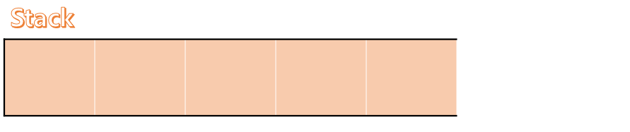
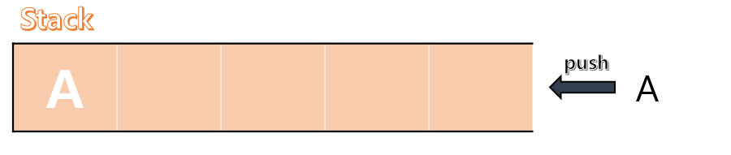
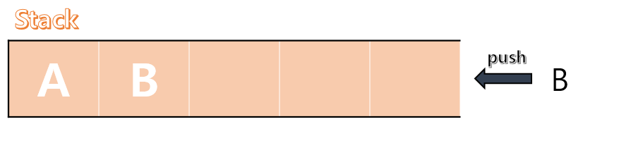
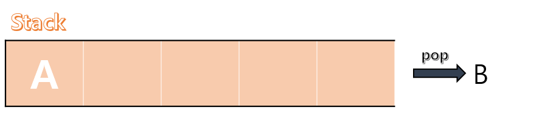
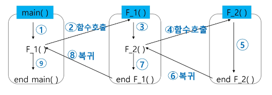

# Stack #1
## 스택
물건을 쌓아 올리듯 자료를 쌓아 올린 형태의 자료구조
- 스택은 선형 구조이다.
  > 자료 간의 관계가 1대 1이다.
- 스택은 자료를 위로 쌓아올리고, 위에서부터 꺼내 쓰는 방식으로, **<span style = "color:red">후입선출</span>** *(LIFO, Last-In-Fisrt-Out)* 이라고 부른다.
- 마지막으로 삽입된 원소의 위치를 **top** 이라고 부른다.

### 스택의 구현
  #### 자료구조
  - 자료를 선형으로 저장할 저장소
  - 배열 사용 가능
  - 저장소 자체를 스택이라 부르기도 함
  #### 연산
  - 삽입 : 저장소에 자료 저장 *(push)*
  - 삭제 : 저장소에서 자료 추출 *(pop)*
  - 공백 확인 : *isEmpty*
  - top 원소 반환 : *peek*

### 스택의 과정
1. stack 배열을 빈 배열로 생성한다.
  
2. 값을 push 한다.
  
  
3. top에서부터 pop을 진행한다.
  

### 스택의 구현
  #### push
  ```python
  def push(item, size):
    global top
    top += 1 # top 인덱스를 1 증가시킨다.
    if top == size:
      # 증가한 top이 stack 배열을 초과한다면
      print('Overflow..!')
    else:
      # 초과하지 않는다면 item을 해당 칸에 할당한다.
      stack[top] = item

  size = 5
  stack = [0] * size
  top = -1
  # stack 배열과 top의 초기값 설정

  push(1, size)
  push(2, size)

  # stack 출력 : [1, 2, 0, 0, 0]
  ```

  #### pop
  ```python
  def stack_pop():
    global top
    if top == -1:
      # stack 배열의 길이가 0이면
      print('Underflow..!')
      # 여기서는 위의 기능을 top이 -1일 때로 입력하였다.
      return 0 # else문의 형식과 맞춰주기 위함
    else:
      # 길이가 0이 아니라면
      top -= 1 # top을 먼저 감하고
      return stack[top + 1] # 감하기전 top의 stack 값을 반환

      # 다만 이 경우 stack 배열 길이를 감소시킬 수는 없다. 
      # (완전한 pop의 기능은 아니다.)
  ```

## 함수에서의 스택 기본
### Function call
프로그램에서 함수 호출과 복귀에 따른 수행 순서를 관리

- 가장 **마지막에 호출**된 함수가 **가장 먼저 실행**을 완료하고 복귀하는 후입선출 구조
- 동일한 구조인 <span style = "color:red">스택</span>을 이용하여 수행순서를 관리할 수 있다!!!
  > 정의를 봤을 때, 재귀호출과 동일해 보인다.<br>
  > 처음 호출된 함수부터 마지막으로 호출된 함수 *<span style = "color : #808080">(결과가 a + func()이 아닌 경우)</span>* 까지 돌고,<br>
  > 그 반환값이 마지막 함수부터 반환되기 때문이다.<br>
  
  > 그러나 Function call이 더 큰 개념이었다.<br>
  > 재귀함수는 유사한 기능의 함수를 반복하는 것이지만,<br>
  > Function call은 그에 상관 없이 어느 한 함수 안에 다른 함수가 있는 모든 경우를 칭하기 때문이다.

### Memoization
> 재귀 함수는 같은 input의 함수를 중복해서 돌리게 된다!<br>
> => 중복을 최소화해보자

**메모이제이션(memoization)** 은 컴퓨터 프로그램을 실행할 때, 이전에 계산한 값을 메모리에 저장하여 중복 계산을 방지해서 전체적인 실행속도를 빠르게 하는 기술이다.

  #### 예시
  ```python
  def fibo_memo(n):
    global memo
    if n >= 2 and memo[n] == 0:
      memo[n] = fibo_memo(n - 1) + fibo_memo(n - 2)
    return memo[n] # fibo_memo(n)의 결과를 memo 리스트에 넣어 반환한다.

  memo = [0] * (n + 1) # 재귀 함수의 각 분기의 값을 저장하기 위한 memo 리스트를 생성한다.
  memo[0] = 0
  memo[1] = 1
  ```
  - 기존의 재귀 함수는 f(n)을 위해 f(1) 까지 모두 계산했어야 했다.
  - Memoization을 이용하면, `n - 1` 이하에서의 함수값을 재계산 할 필요 없이 memo 리스트에서 불러오면 된다.
  > **계산 시간이 크게 감소했다!!!**

## DP (Dynamic Programming)
크기가 작은 부분 문제들을 모두 해결한 후에 <br>그 해들을 이용하여 큰 크기의 부분 문제들을 해결해서,<br> 최종적으로 원래 주어진 문제를 해결하는 알고리즘

  #### 예시
  ```python
  def fibo_dp(n):
    f = [0] * (n + 1)
    f[0] = 0
    f[1] = 1
    for i in range(2, n + 1):
      f[i] = f[i - 1] + f[i - 2]
  ```

  #### 구현 방식
  - recursive 방식
  - iterative 방식

## DFS
그래프에서 시작점의 한 방향으로 나아갈 때, <br>더 이상 갈 곳이 없다면 가장 마지막 분기점으로 돌아가 다른 방향을 탐색하는 알고리즘

  #### 방식 (그림)
  

  #### 구현
  ```python
  """
  input:
  1
  7 8
  1 2 1 3 2 4 2 5 4 6 5 6 6 7 3 7
  """
  def DFS(s, v):
    visited = [False] * (v + 1) # 방문한 정점을 표시
    stack = [] # 스택 생성
    visited[s] = True # 시작 정점 방문 표시
    cv = s
    while True:
      for w in adjL[cv]: # v에 인접하고, 방문 안 한 w가 있으면
        if visited[w] == False:
           stack.append(cv) # 현재 정점을 push하고
           cv = w # w에 방문
           visited[w] = True
           break
      else: # 남은 인접 정점이 없어서 break가 걸리지 않은 경우
        if stack:
          cv = stack.pop() # 마지막 갈림길 정점으로 cv 이동
        else:
          break

  T = int(input())
  for tc in range(1, T + 1):
    v, e = map(int, input().split())
    adjL = [[] for _ in range(v + 1)]
    arr = list(map(int, input().split()))
    for i in range(e):
      v1, v2 = arr[i * 2], arr[i * 2 + 1]
      adjL[v1].append(v2)
      adjL[v2].append(v1)
      # 행마다 원소 개수가 다른 2차원 리스트를 만드는 방법

    DFS(1, v)
  ```

## 자체 Q&A


##