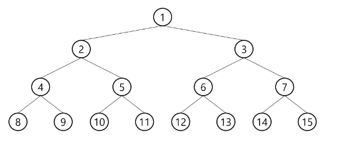
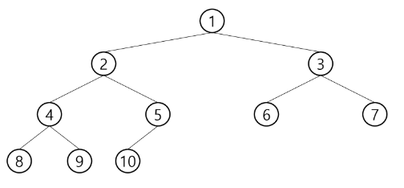
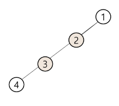
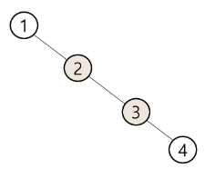
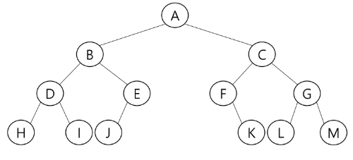

# Tree
## 트리
### 트리의 개념
- 비선형 구조
  > 순서가 없음
- 원소들 간에 1:n 관계를 가지는 자료구조
- 원소들 간에 계층관계를 가지는 구조
- 상위 원소에서 하위 원소로 내려가면서 확장되는 모양의 구조

### 트리의 정의
한 개 이상의 노드로 이루어진 유한 집합이다.
- 최상위 노드는 '루트'라고 한다.
- 나머지 노드들은 n개의 분리 집합으로 나타낼 수 있다.
  > 분리 집합들은 각각 하나의 트리로 볼 수 있으며, 이를 `부 트리(subtree)`라고 한다.

### 트리의 용어
- 노드 : 트리의 원소
- 간선 : 노드를 연결하는 선
- 루트 노드 : 트리의 시작 노드
- 형제 노드 : 같은 부모 노드의 자식 노드들
- 조상 노드 : 한 노드에서 간선을 따라 루트 노드까지 이르는 경로의 모든 노드들
- 서브 트리 : 부모 노드와 연결된 간선을 끊었을 때 생성되는 트리
- 자손 노드 : 서브 트리에 있는 하위 레벨의 노드들
- 차수
  - 노드의 차수 : 노드에 연결된 자식 노드 수
  - 트리의 차수 : 노드의 차수 중 최대값
  - 리프 노드 : 자식 노드가 없는 노드
- 높이
  - 노드의 높이 : 루트에서 노드에 이르는 간선 수
  - 트리의 높이 : 노드의 높이 중 최대값

## 이진 트리
모든 노드들이 2개의 서브 트리를 갖는 특별한 형태의 트리
- 각 노드가 자식 노드를 최대 2개까지 가질 수 있다.
- 왼쪽을 `왼쪽 자식 노드`, 오른쪽을 `오른쪽 자식 노드`라고 한다.

### 이진 트리 특성
- 레벨 i(높이가 i)에서의 최대 노드 개수는 `2^i`개 이다.
- 높이가 h인 이진 트리는 최소 `h + 1`개 에서 최대 `2^(h+1) - 1`개의 노드를 가질 수 있다.

### 이진 트리 종류
  #### 포화 이진 트리 (Full Binary Tree)
  - 높이가 h일 때, 최대 노드 개수 `2^(h+1) - 1`를 가진 이진 트리
  

  #### 완전 이진 트리 (Complete Binary Tree)
  - 높이가 h이고 노드 수가 n개일 때, 포화 이진 트리의 루트 노드부터 n번까지 빈 자리가 없는 이진 트리
  - 
  
  #### 편향 이진 트리 (Skewed Binary Tree)
  - 높이 h일 때의 최소 노드 개수를 가지면서, 한쪽으로만 편향된 이진 트리
  - 선형 리스트와 동일하여 트리의 장점을 살리지 못함
  - 그래서 이를 해결하는 몇가지 알고리즘이 존재
    > 왼쪽 편향 트리

    

    > 오른쪽 편향 트리

    

## 이진 트리의 순회
트리의 각 노드를 중복되지 않게 전부 방문하는 것을 순회라고 한다.
- 그러나 비선형구조라 선후 연결 관계를 알수가 없기에 특별한 방법이 필요하다.
  
### 순회 방법
  #### 전위 순회(preorder traversal - VLR)
  부모노드 방문 후, 자식노드를 좌우 순서로 방문
  
  - 수행 방법
    
    1. 현재 노드 n을 방문하여 처리
    2. 현재 노드 n의 왼쪽 서브트리로 이동
    3. 현재 노드 n의 오른쪽 서브트리로 이동
    ```python
    def preorder_traverse(T):
      if T:
        visit(T)
        preorder_traverse(T.left)
        preorder_traverse(T.right)
    ```

  #### 중위 순회(inorder traversal - LVR)
  왼쪽 서브트리부터 이동하여 노드 방문

  - 수행 방법
  
    1. 현재 노드 n의 왼쪽 서브트리로 이동
    2. 현재 노드 n을 방문하여 처리
    3. 현재 노드 n의 오른쪽 서브트리로 이동
    ```python
    def inorder_traverse(T):
      if T:
        inorder_traverse(T.left)
        visit(T)
        inorder_traverse(T.right)
    ```

  #### 후위 순회 (postorder traversal - LRV)
  서브 트리들 먼저 확인하여 노드 방문

  - 수행 방법
    
    1. 현재 노드 n의 왼쪽 서브트리로 이동
    2. 현재 노드 n의 오른쪽 서브트리로 이동
    3. 현재 노드 n을 방문하여 처리
    ```python
    def postorder_traverse(T):
      if T:
        postorder_traverse(T.left)
        postorder_traverse(T.right)
        visit(T)
    ```

    #### 예시
    아래와 같은 이진 트리가 있을 때
    
    - 전위 순위
      > A B D H I E J C F K G L M
    - 중위 순위
      > H D I B J E A F K C L G M
    - 후위 순위
      > H I D J E B K F L M G C A
