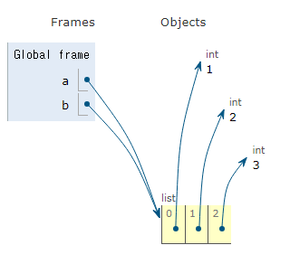
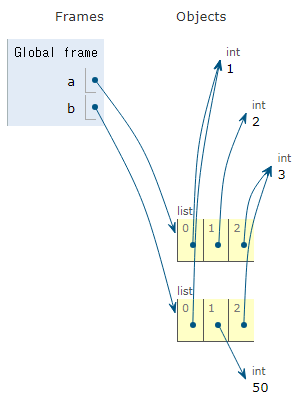
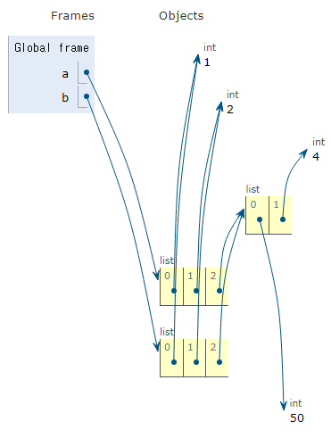
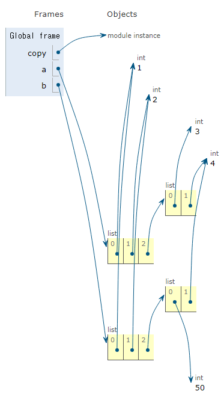

# Copy
파이썬에서는 데이터의 분류에 따라 복사가 달라짐
- 가변 데이터와 불변 데이터의 차이 존재

## 할당
할당은 복사가 아니다. 
- 가변 데이터의 경우 a를 b에 할당했을 때, b는 a의 값을 복사한 것이 아닌 a의 **객체 참조**를 복사한 것이다.
  ```python
  a = [1, 2, 3]
  b = a
  b[1] = 50
  # a : [1, 50, 3]
  # b : [1, 50, 3]
  ```
  
  > a와 b가 같은 리스트의 주소로 연결되었기에 b의 요소가 바뀌면 a의 요소도 바뀐다.
- 불변 데이터는 변수에 새로운 값을 할당할 때마다 새롭게 **재할당**된다.

## 얕은 복사 (Shallow Copy)
슬라이싱으로 생성된 객체는 원본 객체와 독립적으로 존재
- 겉으로는 같은 값을 가진 객체이더라도 그 주소는 다름
  ```python
  a = [1, 2, 3]
  b = a.copy()
  # `b = a[:]`와 동일
  b[1] = 50
  # a : [1, 2, 3]
  # b : [1, 50, 3]
  ```
  
  > 할당과 달리 a와 b가 서로 다른 리스트 주소와 연결된 것을 볼 수 있다.
  
  ### 얕은 복사의 한계점
  2차원 리스트와 같이 변경 가능한 객체 안에 변경 가능한 객체가 있는 경우
  - 내부 변경 가능한 객체의 요소는 복사의 영향을 받지 않고 할당될 수 있음
  - 내부 객체의 주소는 같기 때문에 발생
  ```python
  a = [1, 2, [3, 4]]
  b = a.copy()
  b[2][0] = 50
  # a = [1, 2, [50, 4]]
  # b = [1, 2, [50, 4]]
  ```
  
  > 가장 외부의 리스트는 서로 다른 리스트 주소로 연결되었지만<br>인덱스 2의 리스트는 같은 주소로 연결됨을 볼 수 있다. 

## 깊은 복사 (Deep Copy)
얕은 복사의 한계점을 보완하기 위해 사용
- `copy` 모듈을 사용
   ```python
   import copy

   a = [1, 2, [1, 2]]
   b = copy.deepcopy(a)
   b[2][0] = 50
   # a : [1, 2, [1, 2]]
   # b : [1, 2, [50, 2]]
   ```
   
   > 외부와 내부 리스트의 주소 모두 a, b가 다르게 연결된 것을 확인할 수 있다.
- 내부에 중첩된 모든 객체까지 새로운 객체 주소를 참조하도록 함

## 자체 Q&A
- 파이썬 공식 문서에는 copy 모듈의 깊은 복사 함수인 deepcopy 사용법이 다음과 같이 나와있다.<br>`copy.deepcopy(x[, memo])`<br>여기서 memo는 무엇일까?
  > memo는 복사과정에서 이미 복사된 개체가 여러번 복사되지 않도록 하기 위해 저장하는 딕셔너리라고 한다.
  ```python
  import copy

  a = [1, 2]
  memo = {}
  b = copy.deepcopy(a, memo)
  print(memo)
  # 출력 : {22010...: [1, 2], 22010...: [[1, 2]]}
  ```
  > 위와 같이 출력된다.<br>
  > key는 메모리 주소로 추정되고, value는 여러 형태의 a요소가 있다.

## 공부 내용 돌아보기
나에게 복사란 `Ctrl + C, V`로, 똑같은 것을 하나 더 만드는 것이었다. 그러나 컴퓨터가 처리하는 관점에서 보니 할당과 복사가 다른 의미였으며, 복사도 그 깊이로 나눌 수 있었다.<br>
메모리에 저장된 값을 **주소**를 이용해 찾아간다는 컴퓨터의 작동 방식에 따라 할당과 복사가 구분되었다.<br>
코딩의 결과에서 차이가 크기 때문에 내가 어떠한 작업을 해야 하는지 확실하게 파악하고 진행해야 될 것이다. 코딩은 단순히 코드를 적는 것이 아니라, 내가 구현하고픈 기능을 미리 그리며 세부적으로 설정하고 그에 맞는 적절한 함수나 모듈을 찾아 조합하는 것임을 다시 한 번 느끼게 되었다.