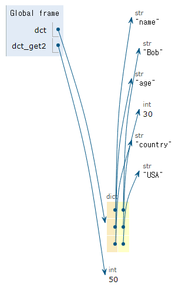

# Data Structure #2
## 비시퀀스 데이터 구조
### 딕셔너리

<div align = "center">

|메서드|내용|
|:---:|:--:|
|`D.clear()`|딕셔너리 D의 모든 키/값 쌍을 제거|
|`D.get(k)`|<span style = "color: RED">키 k에 연결된 값을 반환</span><br><span style = "color: #808080">키가 없으면 None을 반환</span>|
|`D.get(k, v)`|<span style = "color: RED">키 k에 연결된 값을 반환</span><br><span style = "color: #808080">키가 없으면 기본값 v를 반환</span>|
|`D.keys()`|<span style = "color: RED">**키**를 모은 객체를 반환</span>|
|`D.values()`|<span style = "color: RED">**값**을 모은 객체를 반환</span>|
|`D.items()`|<span style = "color: RED">**키/값 쌍**을 모은 객체를 반환</span>|
|`D.pop(k)`|<span style = "color: RED">키 k를 제거하고 연결되었던 값을 반환</span><br><span style = "color: #808080">없으면 오류</span>|
|`D.pop(k, v)`|<span style = "color: RED">키 k를 제거하고 연결되었던 값을 반환</span><br><span style = "color: #808080">없으면 v를 반환</span>|
|`D.setdefault(k)`|키 k와 연결된 값을 반환|
|`D.setdefault(k, v)`|키 k와 연결된 값을 반환<br>k가 D의 키가 아니면 값 v와 연결한 키 k를 D에 추가하고 v를 반환|
|`D.update(other)`|other 내 각 키에 대해 D에 있는 키면 그 키의 값을 other에 있는 값으로 대체<br>D에 없는 키면 키/값 쌍을 D에 추가|
</div>

  #### get
  `.get(key[, default])`
  - 키에 연결된 **값**을 반환
  - 없으면 **None** 또는 **default** 반환
  ```python
  person = {'name': 'Amy', 'age': 25}

  person.get('name') # Amy
  person.get('country') # None
  person.get('country', 'Unknown') # Unknown
  ```

  #### key
  `.keys()`
  - **딕셔너리 키**를 모은 객체를 반환
  ```python
  person = {'name': 'Amy', 'age': 25}

  person.keys()
  # dict_keys(['name', 'age'])
  # => 처음보는 형태이지만 내부 모양이 List와 같으므로 유사하게 취급할 수 있다.
  ```

  #### value
  `.values()`
  - **딕셔너리 값**을 모은 객체를 반환
  ```python
  person = {'name': 'Amy', 'age': 25}

  person.values()
  # dict_values(['Amy', 25])
  ```

  #### item
  `.items()`
  - **딕셔너리 키/값 쌍**을 모은 객체를 반환
  ```python
  person = {'name': 'Amy', 'age': 25}

  person.items()
  # dict_items([('name', 'Amy'), ('age', 25)])
  ```

  #### pop
  `.pop(key[, default])`
  - 키를 제거하고 연결됐던 값을 반환
  - 해당 키가 없다면 **Error** 또는 **default** 반환
  ```python
  person = {'name': 'Amy', 'age': 25}

  person.pop('age') # 25
  person # {'name': 'Amy'}
  person.pop('country') # KeyError
  person.pop('country', None) #  None
  ```

  #### setdefault
  `.setdefault(key[, default])`
  - 키와 **연결된 값**을 반환
  - 키가 없다면 default를 값으로 가지는 키를 추가하고 **default**를 반환
  ```python
  person = {'name': 'Amy', 'age': 25}

  person.setdefault('country', 'Korea') # Korea
  person.setdefault('address')
  person # {'name': 'Amy', 'age': 25, 'country': 'Korea', 'address': None}
  # key만 입력하면 None을 값으로 하여 추가된다.
  ```

  #### update
  `.update([other])`
  - other가 제공하는 키/값 쌍으로 딕셔너리를 갱신
  - 기존 키를 덮어씀
  ```python
  person = {'name': 'Amy', 'age': 25}
  other_p = {'name': 'Jane', 'gender': 'F'}

  person.update(other_p) # {'name': 'Jane', 'age': 25, 'gender': 'Female'}
  # name은 갱신되고, 없던 gender는 추가되었다.
  # 기존 key이며, other 딕셔너리에 없는 key인 age는 변화 없다.
  person.update(age = 50, country = 'Korea')
  # {'name': 'Jane', 'age': 50, 'gender': 'F', 'country': 'Korea'}
  ```

### 세트

<div align = "center">

|메서드|내용|
|:---:|:--:|
|`S.add(x)`|<span style = "color: RED">세트 S에 항목 x를 추가</span><br><span style = "color: #808080">이미 x가 있다면 변화 없음</span>|
|`S.clear()'|세트 S의 모든 항목을 제거|
|`D.remove(x)`|<span style = "color: RED">세트 S에서 항목 x를 제거</span><br><span style = "color: #808080">항목 x가 없을 경우 KeyError</span>|
|`S.pop()`|세트 S에서 임의의 항목을 반환하고, 해당 항목을 제거|
|`S.discard(x)`|세트 S에서 항목 x를 제거|
|`S.update(iterable)`|세트 S에 다른 iterable 요소를 추가|
</div>

  #### add
  `.add(x)`
  - 세트에 x를 추가
  - set형은 순서가 없기 때문에 추가되는 x가 들어가는 위치는 무작위다.
  - 중복이 없는 set의 특성으로 똑같은 값을 add해도 변화가 없다.

  #### remove
  `.remove(x)`
  - 세트에서 **특정 항목 x**를 제거

  #### pop
  `.pop()`
  - 세트에서 **임의의** 요소를 제거하고 **반환**
  - 그러나 완전 무작위는 아님

  #### discard
  `.discard()`
  - 세트에서 항목 x를 제거
  - **에러가 없다**는 것이 remove와 차이
  - 아무 일도 일어나지 않음

  #### update
  `.update(iterable)`
  - 세트에 다른 iterable 요소를 추가

### set 집합 메서드

<div align = "center">

|메서드|연산자|내용|
|:---:|:---:|:---:|
|`set1.difference(set2)`|**set1 - set2**|set1의 차집합|
|`set1.intersection(set2)`|**set1 & set2**|set1과 set2의 교집합|
|`set1.issubset(set2)`|**set1 <= set2**|set1이 set2의 부분집합이면 **True**|
|`set1.issuperset(set2)`|**set1 >= set2**|set1이 set2를 포함하는 집합이면 **True**|
|`set1.union(set2)`|**set1 \| set2**|set1과 set2의 합집합|
</div>

## 해시 테이블
해시 함수를 사용하여 변환한 값을 인덱스로 하여 key와 value를 저장하는 자료구조
- 데이터를 효율적으로 저장하고 검색하기 위해 사용

### 해시 테이블 원리
키를 해시 함수를 통해 해시 값으로 변환하고, 그 값을 인덱스로 사용하여 데이터를 저장하거나 검색
- 파이썬을 새로 실행될때마다 해시 함수는 달라짐
- Jupyter 노트북은 실행마다 파이썬의 환경이 재실행되지 않는다.<br>=> 해시 함수가 그대로 유지된다.
- 해시 함수를 거치면 값의 인덱스가 바로 나옴<br>=> 빠른 검색

### 해시
임의의 크기를 가진 데이터를 고정된 크기의 고유한 값으로 변환하는 것<br>=> 하나의 파이썬 실행 환경에서는 고정

### 해시 함수
임의의 길이의 데이터를 입력 받아 고정된 길이의 데이터(해시 값)를 출력

### set 요소 & dict의 키와 해시 테이블의 관계
set의 요소와 dict의 키는 해시 테이블을 이용하여 중복되지 않는 고유한 값을 저장
- set 요소의 출력은 해시 테이블에 입력된 순서로 출력
- 재실행시 해시 함수가 바뀌기에 set의 출력이 바뀜

> 문자열은 무작위인데 왜 정수형은 해시 테이블에 정해진 순서대로 들어가는가?
>> 파이썬의 해시 함수 동작 방식은 객체 타입에 따라 달라짐<br>
>> 정수와 문자열은 서로 다른 타입<br>
>> 계산하는 방식이 다름<br>

  #### 해시 함수 - 정수
  같은 정수는 항상 같은 해시 값을 가짐
  - **정수는 위치를 재계산하지 않음**
  - 정수를 저장할 때 효율적인 방법

  #### 해시 함수 - 문자
  문자열의 해시값은 실행마다 다르게 계산
  - 문자열은 가변적인 길이를 가짐
  - 각 문자들의 유니코드 코드 포인트 등을 기반으로 해시 값을 계산

### set의 pop 결과와 해시 테이블의 관계
- 임의의 요소를 제거하고 반환
- 실행할 때마다 무작위가 아니라 **임의라는 의미에서 무작위**
  > 해시 테이블에 나타나는 순서대로 반환하는 것

## 파이썬 문법 규격
### BNF
"Backus-Naur Form"
- 프로그래밍 언어의 문법을 표현하기 위한 법칙

### EBNF
BNF의 확장 버전
- 메타 기호 추가로 더 간결하고 표현력이 강해짐
  - `[]` : 선택적 요소
  - `{}` : 0번 이상 반복
  - `()` : 그룹화

### 사용 이유
서로 다른 프로그래밍 언어, 데이터 형식, 프로토콜 등의 문법을 통일하여 정의하기 위함

## 자체 Q&A
- get, setdefault와 update의 작동방식
  > 다음과 같은 딕셔너리가 있다고 하자.
  > ```python
  > dct = {'name': 'Bob', 'age': 30, 'country': 'USA'}
  > ```
  > 먼저 `.get()`을 이용하면
  > ```python
  > dct_get = dct.get('point', 50)
  > ```
  > 
  > 'point' 키가 없으므로 50이 반환되고, 기존 딕셔너리에는 영향이 없음을 볼 수 있었다.<br>
  > 그 다음 `.setdefault()`를 사용하면
  > ```python
  > dct_sdf = dct.setdefault('point', 50)
  > ```
  > 
  > setdefault의 기능으로 딕셔너리에 point라는 새로운 키와 그 값 50이 추가된 모습이다.<br>
  > get이 확인이라면, setdefault는 확인 및 추가를 하는 것이다.<br>
  > 마지막으로 `.update()`를 사용해보자.
  > ```python
  > dct_udt = dct.update({'age': 25, 'product': 'Computer'})
  > ```
  > 
  > 값의 변경과 새로운 키/값 쌍이 추가됨을 확인할 수 있었다.
<br></br>
- pop: 딕셔너리에서 키를 미지정 한다면, 또는 세트에서 인자 입력하면 어떻게 되는가?
  > ```python
  > person = {'name': 'Alice', 'age': 25}
  > person.pop()
  >
  > set_p = {'name', 'gender'}
  > set_p.pop('name')
  > ```
  > 두 경우 모두 **TypeError**가 발생한다.<br>
  > 다만 딕셔너리의 경우 인자가 부족하여, 세트의 경우 인자가 주어져서 발생하였다.<br>
  > 공식 문서에 있는 예시대로 사용해야겠다.

## 공부 내용 돌아보기
오늘 딕셔너리와 세트의 메소드까지 배웠다. 기존에 'append가 왜 안 먹히지'라고 생각한적이 있는데, 앞의 데이터형을 고려하지 않아서 였을 것이다.<br>
어떠한 인자가 필요한지도 확인해야 할 것이다. 보니 공식에서 지정해준 인자를 사용하지 않거나, 그 초과분을 사용하면 오류가 나는 것을 확인하였다.<br>
해시의 개념은 이해하기 어려웠다.
pop 같은 경우 작동을 위해 임의로 선택하지만, 그렇다고 딕셔너리나 세트에 순서가 있는 것은 아니다. 해시 함수에 의해 연결점이 달라지고, 실행 시마다 바뀌니 순서가 있다고 하기는 힘들 것이다. 이는 조금 더 찾아보면 좋을 것 같다. 