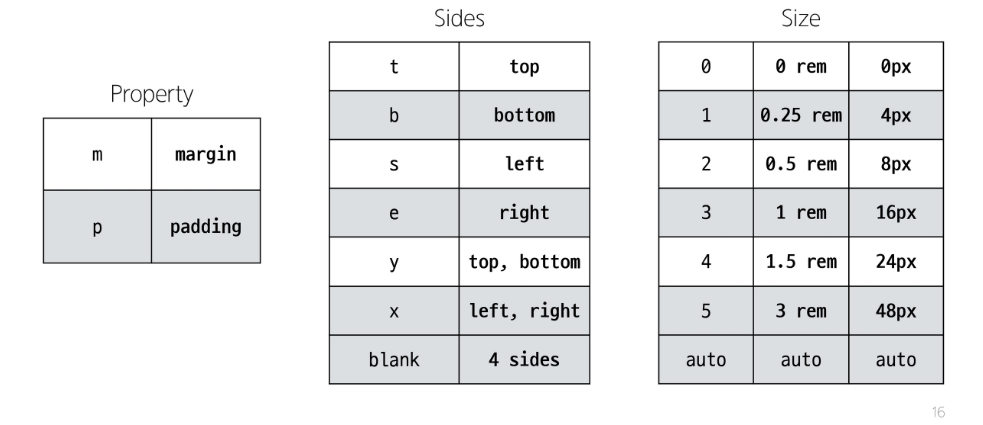
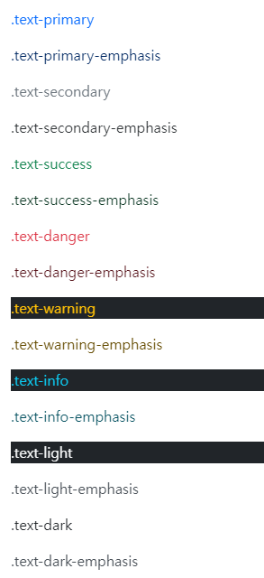

# BootStrap
CSS 프론트엔드 프레임워크
  > 미리 만들어진 다양한 디자인 요소들을 제공하여 웹 사이트를 빠르고 쉽게 개발할 수 있도록 하는 도구 모음

  #### 사용 이유
  - 가장 많이 사용되는 CSS 프레임워크이다.
  - 사전에 디자인된 다양한 Component와 기능을 사용할 수 있다.
  - 손쉬운 반응형 웹 디자인을 구현할 수 있다.
  - 커스터마이징이 용이하다.
  - 모든 브라우저에서 동일하게 기능하는 Cross Browsing을 지원한다.

### CDN
Content Delivery Network
- 지리적 제약 없이 빠르고 안전하게 콘텐츠를 전송할 수 있는 전송 기술

  #### 방식
  - 서버와 사용자 사이의 물리적인 거리를 줄여 콘텐츠 로딩에 소요되는 시간을 최소화
  - 지리적으로 사용자와 **가까운 CDN 서버**에 콘텐츠를 저장해서 사용자에게 전달

### Bootstrap 사용 가이드
  #### Bootstrap의 클래스 이름 표기 방식
  `mt-5`
  - `m` {property} : 속성, margin *(m)* 이나 padding *(p)* 로 표현
  - `t` {sides} : 방향
  - `5` {size} : 크기
  
    > **rem 사용이유!!!** <br>
    > px은 사이즈에 따라 페이지와 그 콘텐츠의 크기가 조절되는 반응형 사이트에서, 크기를 고정시키기에 사용할 수 없다!

## Reset CSS
모든 HTML 요소 스타일을 **일관된 기준으로 재설정**하는 간결하고 압축된 규칙 세트
> HTML에도 임의의 기본 디자인이 존재한다.
> - 문제는 브라우저마다 그 디자인이 다르다.
> - 특정 브라우저로 개발을 하였을 때 기본 디자인 차이로 인해, 기존 혹은 원하는 디자인과 달라질 수 있다.
> - 그러므로 모든 브라우저 기본 디자인을 통일시키고 진행하자는 이유로 `Reset CSS`를 사용한다.

### Normalize CSS
웹 표준 기준으로 브라우저 중 하나가 불일치 한다면 차이가 있는 브라우저를 수정하는 방법

## Bootstrap 활용
### Typography
  #### Display headings


  #### Inline text elements


  #### Lists


### color
  #### text color
  - Bootstrap의 색은 기존에 사용하던 색 이름과는 다르다.
  ```HTML
  <p class="text-primary">.text-primary</p>
  <p class="text-primary-emphasis">.text-primary-emphasis</p>
  <p class="text-secondary">.text-secondary</p>
  <p class="text-secondary-emphasis">.text-secondary-emphasis</p>
  <p class="text-success">.text-success</p>
  <p class="text-success-emphasis">.text-success-emphasis</p>
  <p class="text-danger">.text-danger</p>
  <p class="text-danger-emphasis">.text-danger-emphasis</p>
  <p class="text-warning bg-dark">.text-warning</p>
  <p class="text-warning-emphasis">.text-warning-emphasis</p>
  <p class="text-info bg-dark">.text-info</p>
  <p class="text-info-emphasis">.text-info-emphasis</p>
  <p class="text-light bg-dark">.text-light</p>
  <p class="text-light-emphasis">.text-light-emphasis</p>
  <p class="text-dark bg-white">.text-dark</p>
  <p class="text-dark-emphasis">.text-dark-emphasis</p>
  ```
  

  #### background color
  Bootstrap을 이용하여 텍스트를 둘러싸는 영역의 색도 정할 수 있다.

### Component
Bootstrap Component
- Bootstrap에서 제공하는 UI 관련 요소
- 버튼, 네비게이션 바, 카드, 폼, 드롭다운 등이 있다.

  #### Alerts
  ```HTML
  ```

  #### Carousel
  - `Carousel`은 id 속성 값과 각 버튼의 data-bs-target 속성 값이 일치해야 한다.

  #### Modal
  **주의사항**
  아래쪽에 모아두기
  잘못하면 비활성화(회색) 페이지 뒤로 모달이 넘어가 모달의 버튼을 입력할 수 없음.
  버튼과 함께 다닐 필요 없다.
  id와 target이 동일한지 확인.

  #### Component 이점
  - 일관된 디자인을 제공하여 웹 사이트의 구성 요소를 구축하는 데 유용하게 활용할 수 있다.

## Semantic Web
웹 데이터를 **의미**론적으로 구조화된 형태로 표현하는 방식
- 요소가 가지는 목적과 역할을 코드 상에 담는다!

  #### 예시
  - 제목
  ```HTML
  ```

  #### 좋은점
  검색엔진 및 개발자가 웹 페이지 콘텐츠를 이해하기 쉽게 할 수 있다.

  #### 대표 Semantic Element
  |Element|
  |:-----:|
  |`header`|
  |`nav`|
  |`main`|
  |`article`|
  |`section`|
  |`aside`|
  |`footer`|

  ==> 기능은 `div`와 100% 일치한다.

### CSS의 Semantic
CSS를 효율적이고 유지 보수가 용이하게 작성하기 위한 일련의 가이드라인
> `OOCSS` : 객체 지향적 접근법을 적용하여 CSS를 구성하는 방법론
>
> **기본 원칙**
> 1. 구조와 스킨을 분리<br>
> `blue-button` 대신에 `button-blue`로한다.<br>
> 공통 구조인 `button`을 먼저 만들고, 각각의 스킨인 `button-blue`를 뒤에 정의한다.
> 
> 2. 컨테이너와 콘텐츠를 분리
>> - 객체를 둘러싸는 컨테이너에 스타일을 적용한다.
>>
>> - 의존적인 스타일을 사용하지 않도록 한다.
>>
>> - 재배치 할 때 스타일이 깨지는 것을 방지한다.

## 참고
### 웹 접근성
웹사이트나 도구, 기술이 고령자나 장애인들도 사용할 수 있도록 설계하고 개발하는 것을 의미한다.
- 스크린 리더로 시각장애 사용자에게 웹 글씨를 읽어주는 것도 웹 접근성의 예시이다.


## Q


# ㄱㅂ